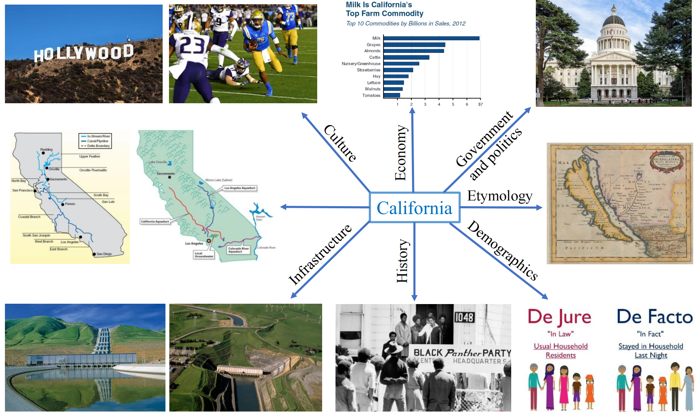

# AspectMMKG

This repository contains the data for our CIKM 2023 paper *AspectMMKG: A Multi-modal Knowledge Graph with Aspect-aware Entities*.

     
    
     

We introduce AspectMMKG, the first multi-modal knowledge graph (MMKG) with aspect-related images by matching images to different entity aspects. Our AspectMMKG contains 2,380
entities, 18,139 entity aspects, and 645,383 aspect-related images.

## Downloading AspectMMKG

https://drive.google.com/file/d/1xakCsNUDc5N4A7Ph197p9ZNcyGvGMxpN/view?usp=sharing
